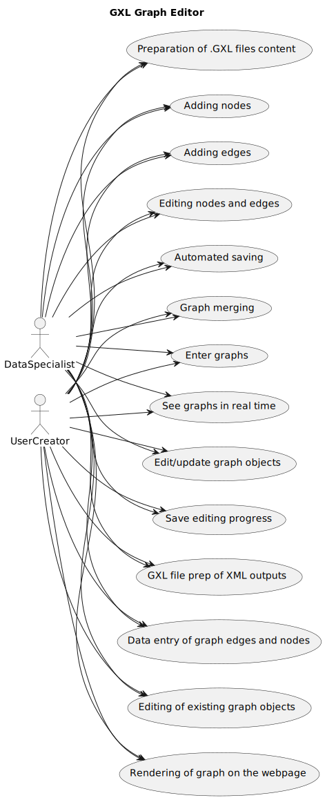

# GXL Graph Editor
The following folder shows an attempt at filling out the SOW questionaire for the `GXL Graph Editor`.
The Tool is a re-hack at the [RBGT's](https://github.com/ActuallyFro/RBGT) "Builder".
However, BreakFAST aims to reduce scope creep, while giving a more directed/concerted development efffort leveraging ChatGPT with GPT-4.

## Focused Analysis Questions [SOW] (v1.0.0)
The JSON file for the answered questionaire can be found [here](01_SOW-Questions-Answered.json)

## Additional Research into "Diagraming"
To support the goal of SOW's phase of `` I did further R&D into other supporting diagrams to potentially prepare for the COW/HEN phases.
According to Professor Francis T. Marchese's lecture on identifying other requirements [^2], he showed several Group Idea Facilitation Methods include: mind mapping, fishbone diagrams, pareto diagrams, brainstorming, multi-voting, dot voting, nominal group process, brainwriting, and affinity grouping.

I also found an article by Dr. Maria Yang [^1], which originally surveyed people with 12 questions, but it enumerated: 

* Need finding (user interviews and observation)
* Benchmarking with comparable products or services
* Storyboarding
* Brainstorming (highest 92.9% AT WORK!)
* House of Quality/Quality Function Deployment (QFD)
* Axiomatic Design
* TRIZ
* Design for X
* Failure Modes and Effects Analysis (FMEA)
* Systematic Design (Pahl and Beitz)
* Total design (Pugh Concept Selection)
* Design Structure Matrices, Robust Design
* Extreme (pair) programming.

However, through execution of the survey it also identified:

* Express-test-cycle iteration with users
* Mind mapping
* Decomposition
* System Architecting (a nod to DoDAF)
* Integrated design process or parallel design
* How-why diagrams
* De Bono's 6 hats
* User testing.

### Honorable Mention: Success Measures

Dr. Yang's survey ALSO asked for measures of success regarding customer/client requirements [^2]:

* Customer/client gives positive feedback
* Design meets performance requirements
* Design is completed within deadline(s)
* Manager/boss gives positive feedback
* Concept is innovative
* Sense of personal pride in design
* Sales increase because of this project

## Using ChatGPT To Brainstorm/Whiteboard
I decided to leverage ChatGPT, beacause I responded to the questions alone. 
I used my direct JSON outputs, with a prompt requesting either a Mermaid.js or PlantUML output of: (1) a Fishbone diagram, (2) a How-why diagram, and (3) a Usecase Diagram.

## References
[^1]: Marchese, F.T. (2002). IDENTIFYING OTHER REQUIREMENTS. Lecture 4. CS616 – Software Engineering II. Retrieved on April 30, 2023, from http://csis.pace.edu/~marchese/CS616/Lec4/se_l4.htm.
[^2]: Yang, MC. "Design Methods, Tools, and Outcome Measures: A Survey of Practitioners." Proceedings of the ASME 2007 International Design Engineering Technical Conferences and Computers and Information in Engineering Conference. Volume 3: 19th International Conference on Design Theory and Methodology; 1st International Conference on Micro- and Nanosystems; and 9th International Conference on Advanced Vehicle Tire Technologies, Parts A and B. Las Vegas, Nevada, USA. September 4–7, 2007. pp. 217-225. ASME. 

