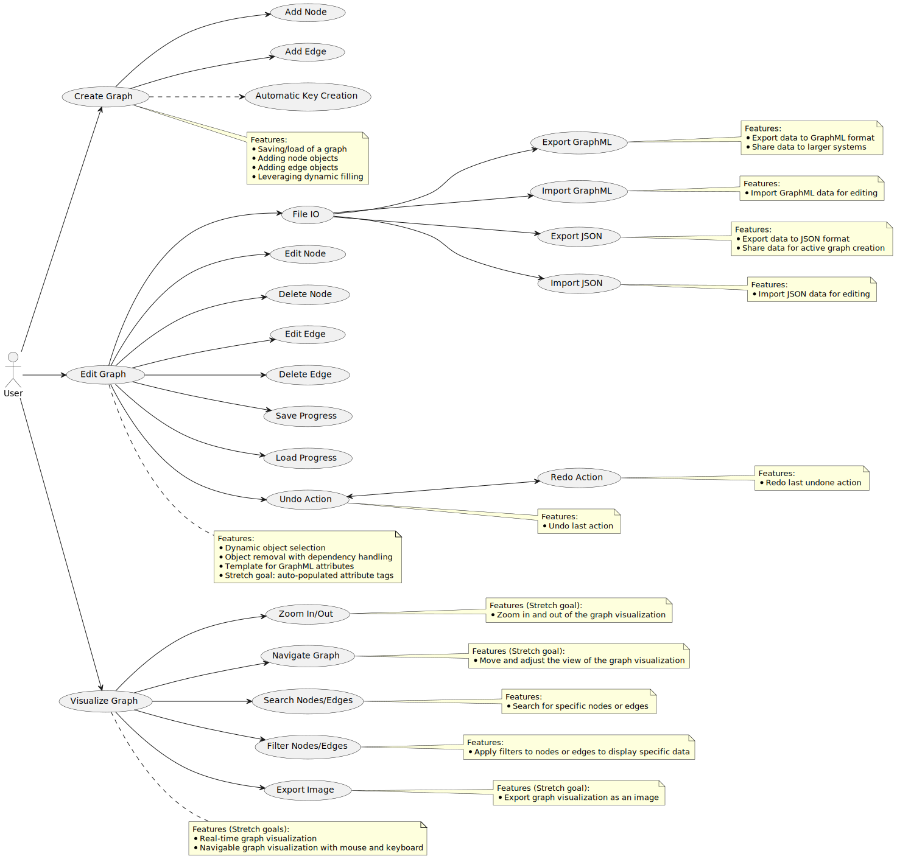

# Scoping Questions [COW] (v1.0.0)
The following folder shows an attempt at filling out the COW questionaire for the `Scoping Questions [COW] (v1.0.0)`.
The Tool is a re-hack at the [RBGT's](https://github.com/ActuallyFro/RBGT) "Builder".
However, BreakFAST aims to reduce scope creep, while giving a more directed/concerted development efffort leveraging ChatGPT with GPT-4.

## Focused Analysis Questions [COW] (v1.0.0)
The JSON file for the answered questionaire can be found [here](01_COW-Questions-Answered.json)

## Using ChatGPT To Brainstorm/Whiteboard
I decided to leverage ChatGPT, beacause I responded to the questions alone. 
I used my direct JSON outputs, with a prompt requesting either a Mermaid.js or PlantUML output of: (1) a Fishbone diagram, (2) a How-why diagram, and (3) a Usecase Diagram.

### PlantUML Usecase of Answers to Questions

### PlantUML Epochs MVCR Diagram of Answers to Questions

### PlantUML Capabilities Groupings of Answers to Questions

### Mermaid How-Why of Answers to Questions

