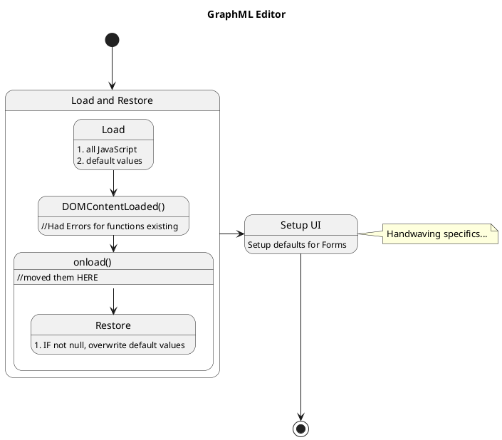

Note
====

At times when developing, or refactoring (e.g., simplification, new features, or bug hunting), planning phases need to be revisited. 
Especially, when NEW code/changes to code cause logical and syntax errors.

For instance: TIMING in how things are loaded in JavaScript is critical -- and can seemingly be non-deterministic.
WHEN several pomodoros are "burnt" (i.e., no meaningful progress made against a task), then it makes sense to "step backwards".
Understanding HOW the code is designed (e.g., the WBS) may need other/supplementary diagrams.
One such diagram is a State Diagram, which PlantUML supports:

The above diagram helps define and show the loading/execution process of the JavaScript files -- and where the code erred.
Alternatively a sequence diagram could have been used.
